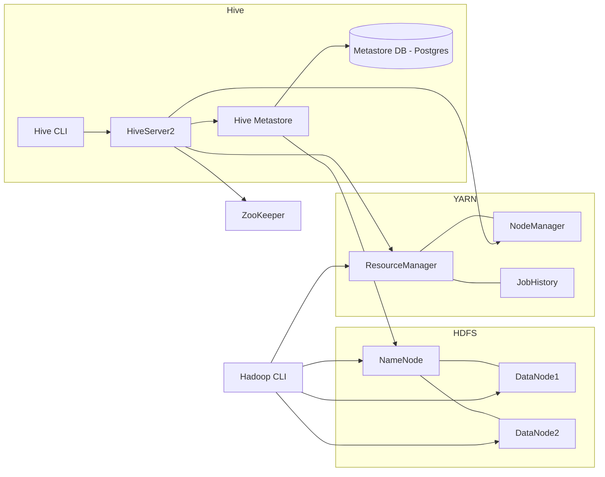

# Hadoop + Hive Docker Compose: Annotated Guide for New Users

This document explains each part of the provided Docker Compose configuration so you can understand **what each service does**, **why certain environment variables/ports are used**, and **how to run and verify** the stack.

> **What you get**: HDFS (NameNode + two DataNodes), YARN (ResourceManager + NodeManager), Hadoop CLI, ZooKeeper, Hive Metastore (PostgreSQL), Hive Metastore service, HiveServer2, and a Hive CLI.


## Full Docker Compose with Inline Commentary

```yaml
services:
  # ===== HDFS (NameNode + DataNodes) =====
 
  namenode:
    image: bde2020/hadoop-namenode:2.0.0-hadoop3.2.1-java8   # Hadoop NameNode image
    container_name: hadoop-namenode
    hostname: namenode                                       # DNS name inside the Docker network
    environment:
      - CLUSTER_NAME=single-node-cluster                     # Tag used by images; not critical for function
      - HDFS_CONF_dfs_replication=1                          # Replication factor (1 for local dev; prod is typically 3)
      - CORE_CONF_fs_defaultFS=hdfs://namenode:8020          # Default HDFS URI that other services use
    ports:
      - "9870:9870"                                          # Expose NameNode web UI to host
      - "8020:8020"                                          # NameNode RPC (client/NN communication)
    volumes:
      - ./data/hdfs/namenode:/hadoop/dfs/namenode            # Persist NameNode metadata to your local disk
    networks:
      - hadoop

  datanode1:
    image: bde2020/hadoop-datanode:2.0.0-hadoop3.2.1-java8   # Hadoop DataNode image
    container_name: hadoop-datanode1
    hostname: datanode1
    environment:
      - CLUSTER_NAME=single-node-cluster
      - CORE_CONF_fs_defaultFS=hdfs://namenode:8020          # Points to the NN declared above
    ports:
      - "9864:9864"                                          # DataNode web UI
    volumes:
      - ./data/hdfs/datanode1:/hadoop/dfs/datanode           # Persist DataNode blocks to local disk
    depends_on:
      - namenode                                             # Start after NN is up
    networks:
      - hadoop

  datanode2:
    image: bde2020/hadoop-datanode:2.0.0-hadoop3.2.1-java8
    container_name: hadoop-datanode2
    hostname: datanode2
    environment:
      - CLUSTER_NAME=single-node-cluster
      - CORE_CONF_fs_defaultFS=hdfs://namenode:8020
    ports:
      - "9865:9864"                                          # Map container UI 9864 to host 9865 to avoid port clash
    volumes:
      - ./data/hdfs/datanode2:/hadoop/dfs/datanode
    depends_on:
      - namenode
    networks:
      - hadoop

  # ===== YARN (ResourceManager + NodeManager) =====
  resourcemanager:
    image: bde2020/hadoop-resourcemanager:2.0.0-hadoop3.2.1-java8
    container_name: hadoop-resourcemanager
    hostname: resourcemanager
    environment:
      - CORE_CONF_fs_defaultFS=hdfs://namenode:8020
    ports:
      - "8088:8088"                                          # YARN ResourceManager web UI
    depends_on:
      - namenode
    networks:
      - hadoop

  nodemanager1:
    image: bde2020/hadoop-nodemanager:2.0.0-hadoop3.2.1-java8
    container_name: hadoop-nodemanager1
    hostname: nodemanager1
    environment:
      - CORE_CONF_fs_defaultFS=hdfs://namenode:8020
      - YARN_CONF_yarn_nodemanager_aux_services=mapreduce_shuffle # Enables MapReduce shuffle service
    ports:
      - "8042:8042"                                          # NodeManager web UI
    depends_on:
      - resourcemanager
    networks:
      - hadoop
  
  # ===== Hadoop CLI (interactive client tools) =====
  hadoop-cli:
    image: bde2020/hadoop-base:2.0.0-hadoop3.2.1-java8       # Base image with Hadoop CLI tools
    container_name: hadoop-cli
    hostname: hadoop-cli
    environment:
      # Point Hadoop CLI to your HDFS
      - CORE_CONF_fs_defaultFS=hdfs://namenode:8020
      # Optional: run commands as 'hdfs' superuser for admin ops (or set to your user)
      - HADOOP_USER_NAME=hdfs
    stdin_open: true
    tty: true
    # Keep the container alive for interactive sessions
    command: ["/bin/bash", "-c", "tail -f /dev/null"]
    depends_on:
      - namenode
      - datanode1
      - datanode2
      - resourcemanager
    networks:
      - hadoop
    volumes:
      # Optional: mount a local folder for scripts/data
      - ./workdir:/workdir

  historyserver:
    image: bde2020/hadoop-historyserver:2.0.0-hadoop3.2.1-java8
    container_name: hadoop-historyserver
    hostname: historyserver
    environment:
      - CORE_CONF_fs_defaultFS=hdfs://namenode:8020
    ports:
      - "8188:8188"                                          # MapReduce JobHistory web UI
    volumes:
      - ./data/hdfs/historyserver:/hadoop/mr-history         # Persist job history files
    depends_on:
      - resourcemanager
    networks:
      - hadoop

  # ===== ZooKeeper =====
  zookeeper:
    image: zookeeper:3.9
    container_name: zookeeper
    hostname: zookeeper
    environment:
      - ZOO_CLIENT_PORT=2181                                 # Client port
      - ZOO_TICK_TIME=2000                                   # Basic timing; fine for single node
      # For a single-node setup, you don't need myid/servers config
    ports:
      - "2181:2181"                                          # Expose client port to host
    networks:
      - hadoop

  # ===== Hive Metastore DB (PostgreSQL) =====
  hive-metastore-db:
    image: postgres:13-alpine
    container_name: hive-metastore-db
    hostname: hive-metastore-db
    environment:
      - POSTGRES_DB=metastore
      - POSTGRES_USER=hive
      - POSTGRES_PASSWORD=hive
    volumes:
      - ./data/metastore-postgres:/var/lib/postgresql/data   # Persist PG data
    ports:
      - "5432:5432"                                          # Optional: connect from host
    networks:
      - hadoop

  # ===== Hive Metastore Service =====
  hive-metastore:
    image: bde2020/hive:2.3.2-postgresql-metastore
    container_name: hive-metastore
    hostname: hive-metastore
    environment:
      - SERVICE_NAME=metastore
      - HIVE_METASTORE_DB_HOST=hive-metastore-db             # Points to the PG service above
      - HIVE_METASTORE_DB_NAME=metastore
      - HIVE_DB_USER=hive
      - HIVE_DB_PASSWORD=hive
      - HIVE_SITE_CONF_fs.defaultFS=hdfs://namenode:8020     # Hive talking to HDFS
      - HIVE_SITE_CONF_hive.metastore.warehouse.dir=/user/hive/warehouse
    ports:
      - "9083:9083"                                          # Thrift metastore port (used by HS2)
    depends_on:
      - hive-metastore-db
      - namenode
    networks:
      - hadoop

  # ===== HiveServer2 (JDBC/Beeline) =====
  hive-server:
    image: bde2020/hive:2.3.2-postgresql-metastore
    container_name: hive-server
    hostname: hive-server
    environment:
      - SERVICE_NAME=hiveserver2
      # Core site (HDFS):
      - CORE_CONF_fs_defaultFS=hdfs://namenode:8020

      # Hive site:
      - "HIVE_SITE_CONF_hive.metastore.uris=thrift://hive-metastore:9083"    # Connect to metastore
      - "HIVE_SITE_CONF_hive.metastore.warehouse.dir=/user/hive/warehouse"  # Warehouse location in HDFS
      - "HIVE_SITE_CONF_hive.server2.thrift.port=10000"                     # HS2 port
      - "HIVE_SITE_CONF_hive.server2.thrift.bind.host=hive-server"          # Bind host
      - "HIVE_SITE_CONF_hive.server2.authentication=NONE"                   # No auth (dev only)
      - "HIVE_SITE_CONF_hive.server2.support.dynamic.service.discovery=true"# Enable ZK registration
      - "HIVE_SITE_CONF_hive.zookeeper.quorum=zookeeper:2181"               # ZooKeeper address
      - "HIVE_SITE_CONF_hive.server2.zookeeper.namespace=hiveserver2"       # ZK namespace
      - "HIVE_SITE_CONF_hive.server2.zookeeper.publish.configs=true"        # Publish configs to ZK

    ports:
      - "10000:10000"                                        # Expose HS2 to host
    depends_on:
      - hive-metastore
      - resourcemanager
      - nodemanager1
      - zookeeper
    networks:
      - hadoop

  hive-cli:
    image: bde2020/hive:2.3.2-postgresql-metastore          # CLI container (beeline/hive shell)
    container_name: hive-cli
    hostname: hive-cli
    environment:
      - SERVICE_NAME=hive-cli
      - CORE_CONF_fs_defaultFS=hdfs://namenode:8020
      - HIVE_SITE_CONF_hive.metastore.uris=thrift://hive-metastore:9083
      - HIVE_SITE_CONF_hive.server2.support.dynamic.service.discovery=true
      - HIVE_SITE_CONF_hive.zookeeper.quorum=zookeeper:2181
      - HIVE_SITE_CONF_hive.server2.zookeeper.namespace=hiveserver2
      - HIVE_SITE_CONF_hive.server2.authentication=NONE
    stdin_open: true
    tty: true
    depends_on:
      - hive-server
      - zookeeper
    networks:
      - hadoop

networks:
  hadoop:
    driver: bridge                                           # Default Docker bridge network; gives DNS between services
```

---

## What Each Component Does

### HDFS
- **NameNode**: Stores filesystem metadata (directories, file locations, permissions). The UI on port **9870** lets you browse HDFS and see DataNodes.
- **DataNodes**: Store actual blocks of data. Each exposes a web UI on **9864** (mapped to host 9864 and 9865).
- **Key env**:
  - `CORE_CONF_fs_defaultFS=hdfs://namenode:8020` is how clients/services find HDFS.
  - `HDFS_CONF_dfs_replication=1` sets replication to 1 for local development.
- **Volumes** persist state across container restarts.

### YARN
- **ResourceManager (8088)**: Central scheduler for jobs/containers.
- **NodeManager (8042)**: Runs containers on worker nodes. `YARN_CONF_yarn_nodemanager_aux_services=mapreduce_shuffle` enables MapReduce shuffle service.

### Hadoop CLI
- An interactive container with Hadoop tools (`hdfs`, `yarn`, `hadoop`). It mounts `./workdir` for easy file sharing.
- `HADOOP_USER_NAME=hdfs` lets you perform admin actions without Kerberos in dev.

### ZooKeeper
- Coordination service used by HiveServer2 for service discovery and client failover.

### Hive Stack
- **Hive Metastore DB (PostgreSQL)**: Stores table/schema metadata.
- **Hive Metastore (9083)**: Thrift service that HiveServer2 consults.
- **HiveServer2 (10000)**: JDBC/Beeline endpoint for running SQL on data in HDFS via YARN/MapReduce/Tez.
- **Hive CLI**: Handy container to run `beeline` or `hive` without installing locally.

---

## Common Commands & Checks

### Hadoop CLI basics
```bash
# Open a shell in the CLI container
docker compose exec hadoop-cli bash

# HDFS: create dirs and put sample file
hdfs dfs -mkdir -p /user/hive/warehouse
hdfs dfs -mkdir -p /data
printf "hello,hadoop\n" > /workdir/sample.csv
hdfs dfs -put /workdir/sample.csv /data/

# List
hdfs dfs -ls /data
```

### Hive quick test
```bash
# Use the hive-cli container
docker compose exec hive-cli bash

# Connect to HS2 via beeline
beeline -u "jdbc:hive2://hive-server:10000/" -n hive -p hive --silent=true <<'SQL'
CREATE DATABASE IF NOT EXISTS demo;
USE demo;
CREATE TABLE IF NOT EXISTS t1 (msg STRING);
LOAD DATA INPATH '/data/sample.csv' INTO TABLE t1;
SELECT * FROM t1;
SQL
```

### Web UIs
- **HDFS NN**: http://localhost:9870 → Check DataNodes are **Healthy**.
- **YARN RM**: http://localhost:8088 → Check **Nodes** tab shows one NodeManager.
- **JobHistory**: http://localhost:8188 → View completed MapReduce jobs.

---

## Troubleshooting Tips
- **Ports already in use**: Change host ports on the left side of `host:container` mappings.
- **Permission issues on mounted volumes**: Ensure your local folders exist and are writable by Docker. On Linux, `chmod -R 777 ./data` (dev only) can unblock.
- **Name resolution**: Services use their `hostname` within the `hadoop` network (e.g., `namenode`, `hive-metastore`). Do **not** use `localhost` inside containers.
- **Hive metastore fails to start**: Confirm `hive-metastore-db` is healthy and port 5432 reachable within the Docker network. Check logs:
  ```bash
  docker compose logs hive-metastore-db | tail -n 50
  docker compose logs hive-metastore | tail -n 50
  ```
- **HS2 connection problems**: Verify `hive-server` logged registration to ZooKeeper and can reach metastore. Check:
  ```bash
  docker compose logs hive-server | tail -n 100
  ```
- **YARN shows 0 nodes**: Ensure `nodemanager1` is up and `resourcemanager` reachable. Check:
  ```bash
  docker compose ps
  docker compose logs nodemanager1 | tail -n 100
  ```

---

## Clean Up
```bash
docker compose down
# Remove volumes if you want a fresh cluster next time (be careful!)
sudo rm -rf ./data ./workdir/*
```

---

## Architecture Overview (Mermaid)

