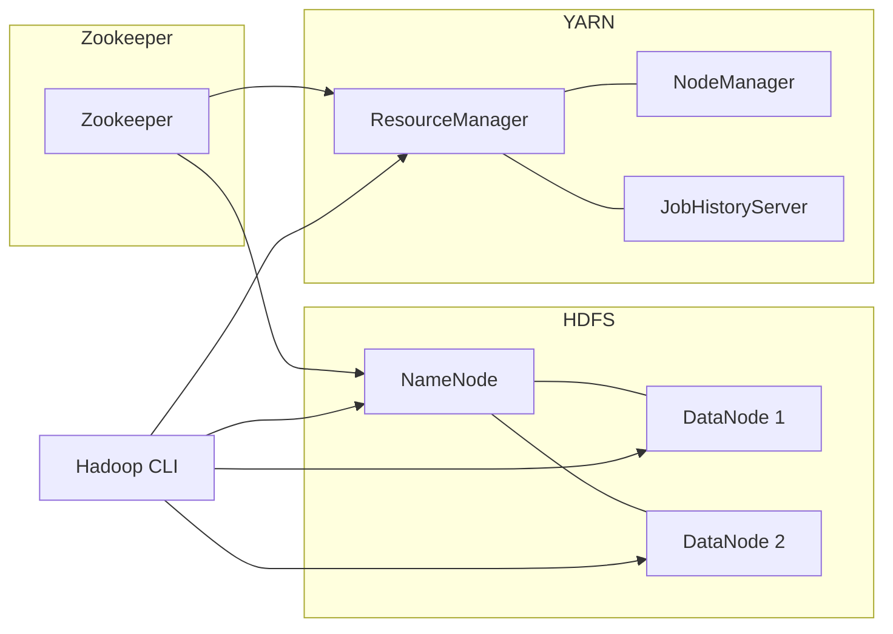

# Lab 1: Hadoop Cluster Setup Using Docker Compose

This lab demonstrates how to set up a Hadoop cluster using Docker Compose. The cluster includes **Zookeeper**, **HDFS (NameNode & DataNodes)**, **YARN**, and a **Hadoop CLI node** for interaction.

---

## Prerequisites
- Docker and Docker Compose installed on your system.
- A `docker-compose.yml` file configured with services for:
  - Zookeeper
  - HDFS NameNode & DataNodes
  - YARN ResourceManager, NodeManager, HistoryServer
  - Hadoop CLI

---

## Steps

### 1. Create Zookeeper Cluster
Start the Zookeeper service:

```bash
docker compose up -d zookeeper
```

---

### 2. Build HDFS NameNode
Start the NameNode service:

```bash
docker compose up -d namenode
```

---

### 3. Build HDFS DataNodes
Start the DataNode services:

```bash
docker compose up -d datanode1
docker compose up -d datanode2
```

---

### 4. Build YARN Cluster
Start the ResourceManager, NodeManager, and HistoryServer:

```bash
docker compose up -d resourcemanager nodemanager1 historyserver
```

---

### 5. Build Hadoop CLI Node
Start the Hadoop CLI container to interact with the Hadoop cluster:

```bash
docker compose up -d hadoop-cli
```

---

## 6. Validate Cluster Setup
Access the following URLs in your browser to verify the services are running:

- **NameNode UI:** http://localhost:9870
- **DataNode1 UI:** http://localhost:9864
- **DataNode2 UI:** http://localhost:9865
- **ResourceManager UI:** http://localhost:8088
- **NodeManager UI:** http://localhost:8042
- **JobHistory UI:** http://localhost:8188

---

## Cluster Architecture Diagram



---

### Next Steps
- Upload files to HDFS using `hadoop fs -put`.
- List files with `hadoop fs -ls /`.
- Submit jobs to YARN using `hadoop jar`.
- Monitor cluster health via the above UIs.

